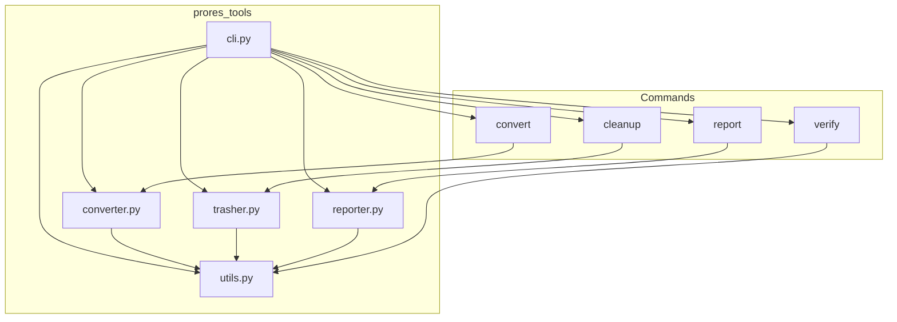

# System Patterns

The `prores-tools` application follows a modular, command-based architecture. The core logic is decoupled from the command-line interface, which allows for easier testing and maintenance.

## Architecture Diagram

